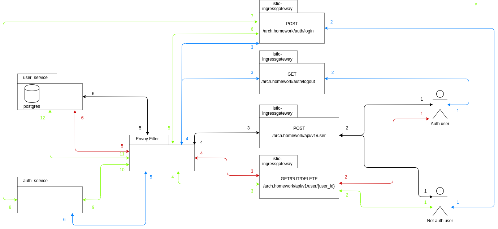
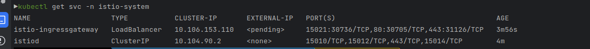

# OTUS Microservices (HW APIGW)

## Зависимости

Для выполнения задания использовались следующие зависимости:

- [Minikube 1.29.0](https://github.com/kubernetes/minikube/releases/tag/v1.29.0)
- [Kubectl 0.26.1](https://github.com/kubernetes/kubectl/releases/tag/v0.26.1)
- [Istioctl 1.17.0](https://github.com/istio/istio/releases/tag/1.17.0)
- [Heml 3.3.4](https://github.com/helm/helm/releases/tag/v3.3.4)

## Описание

## Разворачивание инфраструктуры и сервисов
Выполнить
> sh ./install.sh

Дождаться поднятие istio-ingressgateway
Проверить можно выполнив
> kubectl get svc -n istio-system 

Результат

Так как minikube не позволяет напрямую работать c load balancer, поэтому необходимо записать порт доступа к istio-ingressgateway выполнив команду
> ISTIO_PORT=$(kubectl get svc istio-ingressgateway -o 'jsonpath={.spec.ports[1].nodePort}' -n istio-system)

Или определить его вручную, значение должно совпадать с портом матчинга на 80 ингресса (результат запроса выше)

## Тестирование
> newman run ./postman/HW_collection_APIGW.json --env-var "baseUrl=arch.homework" --env-var "basePort=$ISTIO_PORT"

## Удаление инфраструктуры и сервисов
> sh ./delete.sh